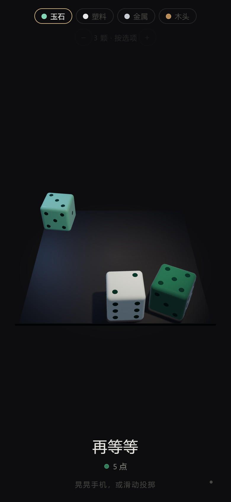
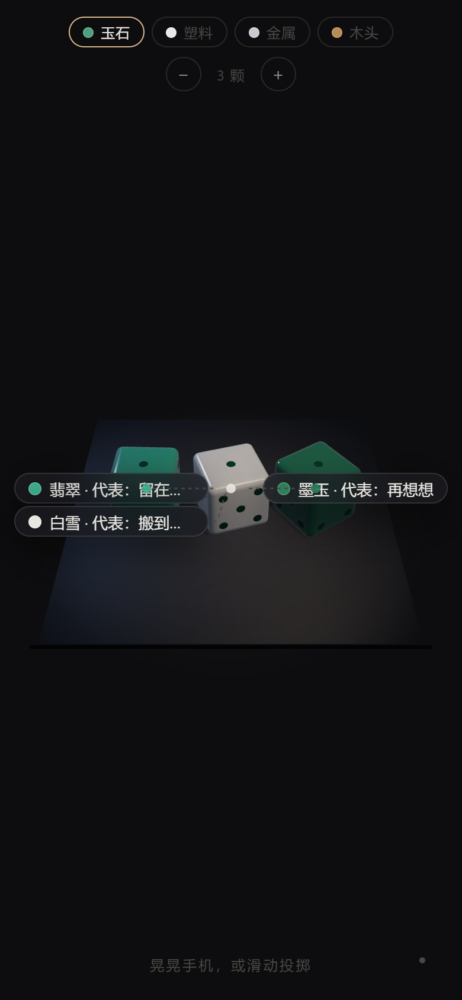
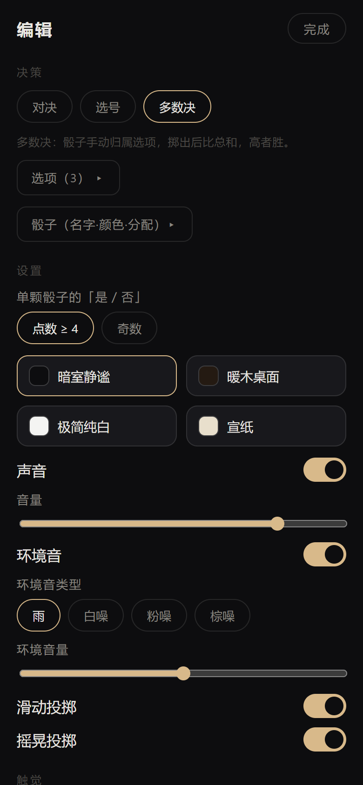
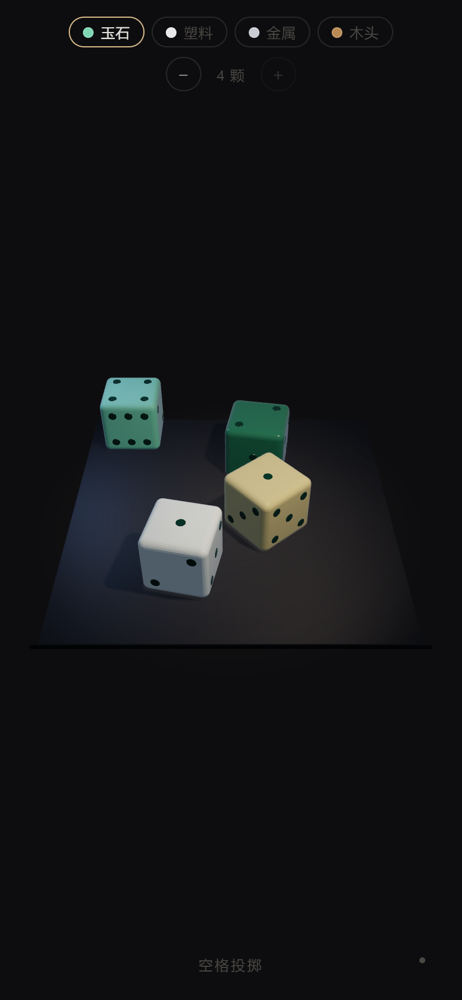

# 骰子 · 郑重的 3D 决策骰盅

**今晚吃什么？谁去洗碗？搬不搬家？** 把选项交给骰子，让偏好自己浮出来。

这是一个跑在手机浏览器里的 3D 骰子应用：真实物理模拟的骰子落进托盘，碰撞声、雨声、震动一起到场 —— 它不催你，只是把「掷骰子」这件事做得足够郑重。

**[在线体验 →](https://mingfeizhang1028.github.io/Dice-rolling/)** （手机打开效果最佳，可添加到主屏幕）

| | | | |
|:---:|:---:|:---:|:---:|
|  |  |  |  |
| 玉石骰子与结果卡 | 长按：名字与选项浮出 | 编辑页 | 12 颗自适应缩放 |

---

## 为什么做这个

市面上的骰子工具几乎都是给**跑团（TRPG）**用的：输入 `2d6+3`，输出一个数字。
但日常生活里的骰子不是这么用的 —— 你真正需要的不是「掷出一个数」，而是：

- 把纠结的选项**摆上台面**，郑重地掷一次；
- 掷完之后，留意自己心里那声「可惜了」—— 它就是你真实的偏好。

所以这个应用没有输入框、没有骰子记法，只有一盏灯、一只托盘，和几种把选择权交给运气的方式。

## 三种决策玩法

在编辑页选择模式，也可以不填任何选项、当作纯骰子用。

| 模式 | 规则 | 适合场景 |
|---|---|---|
| **对决** | 每个选项一颗骰子，点数高者胜。并列时明确告诉你「点数撞上了，你更想选哪一颗？」 | 二选一、三选一 |
| **选号** | 所有骰子点数求和，从头循环数，数到第几个就是它 | 选项多于骰子、或想「雨露均沾」 |
| **多数决** | 每颗骰子手动归属给一个选项，各选项比骰子点数总和 | 想给某个选项「加权」 |
| **是 / 否** | 单颗骰子时，按「点数 ≥ 4」或「奇数」判为「是」 | 问一个封闭问题 |

不填选项时就是普通骰子：1 颗显示点数与是/否，多颗显示点数列表与总和。

## 特性

**真实的物理与手感**

- cannon-es 刚体物理：骰子翻滚、碰撞、弹开，落点由物理决定，不预设结果
- 最多 **12 颗**同时投掷，托盘固定、骰子按数量自适应缩小
- 看不见的挡墙防止骰子飞出托盘；落定看门狗保证结果一定会出
- 滑动 / 点击投掷，**摇一摇**投掷（自动请求 iOS 运动授权），桌面端空格键 —— 三种输入可在编辑页分别开关

**四种材质 × 四套主题，自由混搭**

- 玉石（透光的翡翠质感）、塑料、金属、木头，全部基于物理光照渲染
- 暗室静谧 / 暖木桌面 / 极简纯白 / 宣纸四套主题，换主题时材质自动适配光照
- 每颗骰子可单独换色：14 色调色板或任意自定义色

**感官层**

- 碰撞音**程序化烘焙**生成（零音频文件），按碰撞力度分三档
- 环境音：雨声 / 白噪 / 粉噪 / 棕噪，音量独立可调
- 落定结果时震动反馈（支持的设备上）

**为决策设计**

- 长按屏幕任意处：每颗骰子的**名字与它代表的选项**以标签浮出，曲线引线指向骰子，一眼分清谁是谁
- 多数决模式下每颗骰子的归属可以在编辑页手动指定
- 全部设置本地保存，支持导出 / 导入 JSON

**隐私**

纯前端、无后端、无统计、无广告。所有数据只存在你设备的 localStorage 里。

## 和同类项目的不同

| | 本项目 | [dice-box](https://github.com/3d-dice/dice-box) | [rpg-dice-roller](https://github.com/GreenImp/rpg-dice-roller) | [react-ttrpg-dice](https://www.npmjs.com/package/react-ttrpg-dice) |
|---|---|---|---|---|
| **定位** | 面向**日常决策**的成品应用 | 嵌入游戏的 3D 骰子**库** | 骰子记法解析**库**（无界面） | React 骰子**组件** |
| **典型用法** | 打开即用，掷完拿主意 | 集成进 VTT / 桌游应用 | `new DiceRoll('4d6+2')` | `<DiceOverlay roll="1d20" />` |
| **骰子** | 六面骰，最多 12 颗 | d4–d20 多面骰 | 任意面数 + 修饰符 | d4–d100 多面骰 |
| **决策玩法** | 对决 / 选号 / 多数决 / 是否 | 无（返回点数） | 无（返回点数） | 无（返回点数） |
| **感官层** | 烘焙碰撞音、环境雨声、震动 | 有限 | 无 | 程序化碰撞音 |
| **输入方式** | 滑动 / 摇一摇 / 键盘 | API 调用 | 代码调用 | 代码 / 按钮 |
| **中文界面** | 是（为竖屏手机设计） | 否 | 否 | 否 |

一句话：**跑团记骰用它们，生活做决定用这个。** 本项目刻意只做六面骰 —— 决策不需要 d20，但需要让骰子看起来值得托付。

## 快速开始

**在线使用**：直接访问 [GitHub Pages 部署地址](https://mingfeizhang1028.github.io/Dice-rolling/)。

**本地运行**（需要 Node.js 22+）：

```bash
git clone https://github.com/mingfeizhang1028/Dice-rolling.git
cd Dice-rolling
npm install
npm run dev        # 开发服务器，手机与电脑同一局域网可直接访问
npm run build      # 构建产物到 dist/
```

## 技术架构

零框架，只有三个运行时依赖：[three.js](https://threejs.org/)（渲染）、[cannon-es](https://github.com/pmndrs/cannon-es)（物理）、Vite（构建）。

```
src/
├── main.js          # 装配：把下面所有模块接在一起
├── flow.js          # 决策状态机 BOOT→IDLE→ARMING→THROWING→SETTLING→RESULT
├── config.js        # 唯一调参中心（物理常量、默认值，全部带注释）
├── store.js         # localStorage 持久化 + 版本迁移
├── core/            # 事件总线 / 帧循环 / 随机数
├── scene/           # 相机、灯光、桌面、主题应用
├── dice/            # 骰子几何、材质贴面、读点（从物理姿态反推朝上的面）
├── physics/         # cannon-es 世界、投掷冲量、落定判定
├── input/           # 滑动 / 摇一摇 / 键盘 → 统一的投掷意图事件
├── audio/           # 音频引擎、程序化烘焙的碰撞音、环境音
└── ui/              # 壳层 chip、结果卡、编辑页、长按标注
```

几个值得一提的工程细节（代码注释里有完整推理）：

- **相机按水平视场角定义**，竖屏手机上反推垂直 fov —— 照搬横屏教程会让骰子小得看不见
- **骰子质量永远归一化**：金属密度是木头的 13 倍，照实做金属骰子根本甩不动
- **读点不采样贴图**：从物理体的姿态四元数反推哪面朝上，零误差
- 重力是 -50 而不是 -9.8：高重力让骰子更快落定，观感更好

## 测试

```bash
npm test    # 6 条端到端自测：决策流程 / 音效烘焙 / 环境音 / 震动 / 摇一摇 / 托盘防飞出
```

测试脚本用 CDP 直接驱动本机 Edge（无头 + SwiftShader 软渲染），走**真实链路**：合成浏览器级手势 → 物理落定 → 读点 → 结果卡渲染，并在关键分支（如「并列」）用确定性摆位代替碰运气。

## 部署

推送 `main` 分支后，GitHub Actions 自动构建并部署到 GitHub Pages（见 [.github/workflows/deploy.yml](.github/workflows/deploy.yml)），无需手工操作。

## 已知取舍

- 只有六面骰：决策场景用不到多面骰，这是刻意收窄
- 多数决模式下，骰子数不均的选项天然占优 —— 编辑页会提示，把「分骰子」的权力交给用户而不是算法
- iOS 上「摇一摇」需要每次会话首次交互后请求运动权限，应用会在「开始」按钮里一并处理
